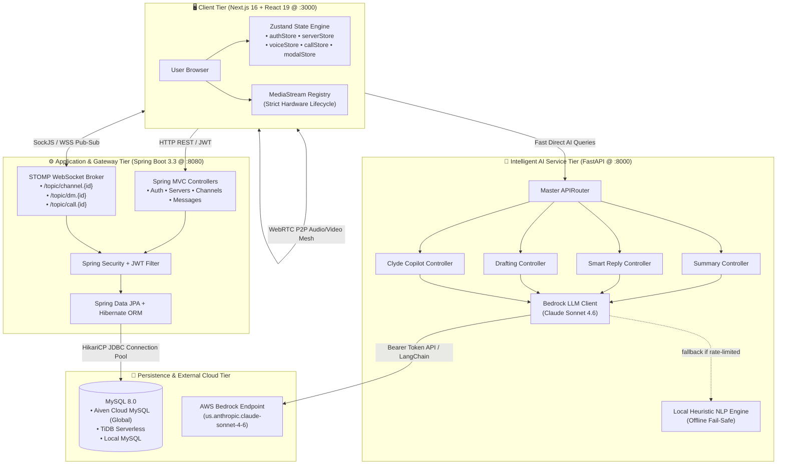
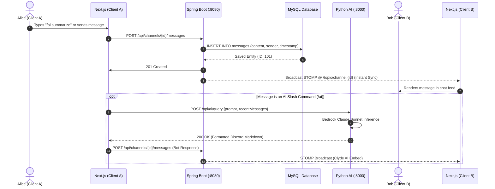
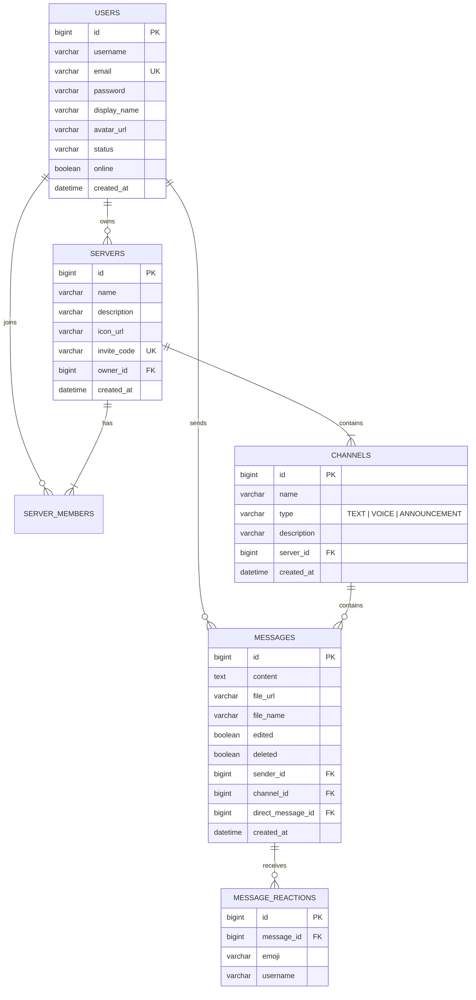
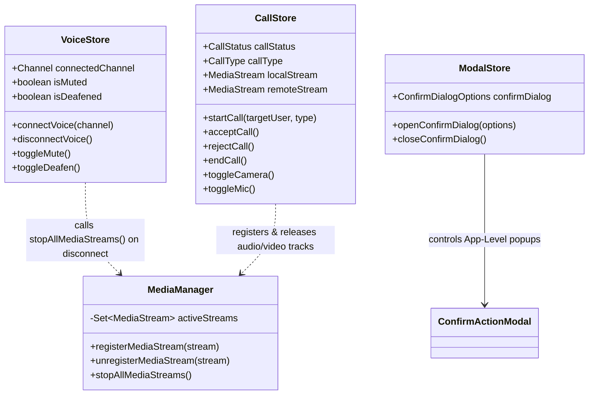

# 🚀 Discord Clone & Intelligent AI Workspace

[](https://nextjs.org/)
[](https://react.dev/)
[](https://spring.io/projects/spring-boot)
[](https://fastapi.tiangolo.com/)
[](https://aws.amazon.com/bedrock/)
[](https://www.mysql.com/)
[](https://stomp.github.io/)
[](https://webrtc.org/)

An enterprise-grade, full-stack **Discord Clone** featuring real-time WebRTC audio/video group calling, STOMP WebSockets messaging, 100% custom inline CSS Discord dark-mode aesthetics, and a modular **MVC Python AI Service Layer** powered by **AWS Bedrock Claude Sonnet**.

---

## ⚡ 1-Liner Quickstart

> **Yes! In just one line, add your API key and launch everything:**

```bash
# Set your AI key and launch all 3 tiers with 1 command:
echo "AWS_BEARER_TOKEN_BEDROCK=your-key-here" > ai_service/.env && chmod +x start.sh && ./start.sh
```

`start.sh` automatically coordinates and launches:
1. 🟢 **Spring Boot Backend** (`:8080`) — verifies health and connects to database.
2. 🟢 **Python AI Service (MVC)** (`:8000`) — boots FastAPI with AWS Bedrock Claude Sonnet.
3. 🟢 **Next.js Frontend** (`:3000`) — launches React 19 app and opens in your browser.
4. 🛑 **Graceful Shutdown** — pressing `Ctrl+C` cleanly terminates all 3 background processes.

---

## 🌟 Highlights & Key Features

- **🎙️ Server Group Calling (Voice Channel Stage)**:
  - Real-time group voice and webcam stage directly inside server voice channels.
  - Screen sharing via `navigator.mediaDevices.getDisplayMedia`.
  - Web Audio API analyser detecting audio volume with a glowing green pulse ring (`#23a55a`) around speaking members.
  - **Zero Hardware Microphone Leaks**: Global media registry guarantees microphone and camera hardware streams are immediately killed upon call disconnect, channel change, or logout.
- **📞 1-on-1 Direct Calling**: Real-time direct audio/video calling with authentic Discord ringtones (synthesized via Web Audio API) and floating call overlays.
- **🤖 Clyde AI Copilot & Smart Inbox Assistant**:
  - In-chat slash commands (`/ai summarize`, `/ai poll [topic]`, `/ai announce [title]`, `/ai explain [topic]`).
  - Slide-out Smart Inbox Assistant drawer for one-click channel catch-ups, smart replies, and draft rewrites.
  - Dedicated 1-on-1 Clyde AI Bot direct message channel (`/dm/ai`).
- **🛡️ App-Level Confirmation Modals**: Pixel-perfect Discord dialogs for deleting channels, deleting servers, leaving servers, and deleting messages.
- **👥 Omnipresent Server Links & Profile Cards**:
  - Click any avatar in chat to view their full profile card with direct links to DM, voice call, or video call.
  - Quick server invite modal with copyable links and 1-click friend invite dispatch.
- **🎨 100% Rich Inline CSS**: Styled without external CSS frameworks for authentic Discord desktop aesthetics.

---

## 🏛️ High-Level Design (HLD)

### 1. System Topology & Tier Architecture



### 2. Real-Time Message Journey & Broadcast Flow



---

## 🔍 Low-Level Design (LLD)

### 1. Database Entity-Relationship (ER) Schema



### 2. Frontend State & Media Stream Architecture



---

## 🌐 Global Cloud MySQL Setup (Connect with Friends Worldwide)

By default, the backend connects to your local MySQL on `localhost:3306`. If you want everyone across the world to access your Discord servers, messages, and calls simultaneously, connect to a **free live cloud database**:

### 🌟 Option 1: Aiven for MySQL (Recommended — 100% Free, No Credit Card)

Aiven provides a full **MySQL 8.0 cloud instance** on AWS/GCP that runs 24/7 without sleeping.

1. **Sign Up**: Go to **[aiven.io](https://aiven.io/)** and sign up (completely free, no credit card required).
2. **Create Service**:
   - Click **Create Service** → Select **MySQL**.
   - Choose the **Free Plan** (5 GB SSD, 1 GB RAM, 1 CPU).
   - Choose a cloud region closest to you (e.g. `aws-ap-south-1` Mumbai, `aws-us-east-1` N. Virginia, or `aws-eu-west-1` Frankfurt).
   - Click **Create Free Service**.
3. **Copy Credentials**:
   - In the Aiven dashboard overview, copy:
     - **Host** (e.g. `mysql-xxxx-project.aivencloud.com`)
     - **Port** (e.g. `12345`)
     - **User** (default: `avnadmin`)
     - **Password**
     - **Database Name** (default: `defaultdb`)
4. **Plug into Your App**:
   Simply set your environment variables (or paste into `backend/src/main/resources/application.properties`):
   ```properties
   spring.datasource.url=jdbc:mysql://<your-host>.aivencloud.com:<port>/defaultdb?sslmode=require
   spring.datasource.username=avnadmin
   spring.datasource.password=<your-password>
   spring.datasource.driver-class-name=com.mysql.cj.jdbc.Driver
   ```

*Hibernate automatically creates all database tables upon starting the backend!*

---

### 🌟 Option 2: TiDB Serverless (25 GB Free Forever)

1. Go to **[tidbcloud.com](https://tidb.cloud/)** and sign in with GitHub.
2. Click **Create Cluster** → Choose **Serverless** (25 GB free forever).
3. Select your preferred region.
4. Click **Connect** → Choose **General / JDBC** to get your connection string.
5. In `application.properties`:
   ```properties
   spring.datasource.url=jdbc:mysql://gateway01.<region>.prod.aws.tidbcloud.com:4000/<dbname>?sslmode=VERIFY_IDENTITY
   spring.datasource.username=<username>
   spring.datasource.password=<password>
   spring.datasource.driver-class-name=com.mysql.cj.jdbc.Driver
   ```

---

### 🌟 Option 3: Railway.app MySQL (Instant 1-Click Provision)

1. Go to **[railway.app](https://railway.app/)** and click **New Project** → **Provision MySQL**.
2. Click the MySQL container → **Connect** → Copy **Public URL**.
3. In `application.properties`:
   ```properties
   spring.datasource.url=jdbc:mysql://<railway-host>:<port>/railway?useSSL=false&allowPublicKeyRetrieval=true
   spring.datasource.username=root
   spring.datasource.password=<password>
   ```

---

## 🤖 Python AI Service (MVC Architecture)

The Python AI service on port `8000` is built using a clean, enterprise **Model-View-Controller / Model-Service-Controller** architecture:

```
ai_service/
├── main.py                          # FastAPI create_app() factory & CORS middleware
├── requirements.txt                 # Dependencies (fastapi, uvicorn, pydantic, langchain-aws, boto3)
├── .env                             # Bedrock credentials (AWS_REGION, AWS_BEARER_TOKEN_BEDROCK, BEDROCK_MODEL_ID)
├── tests/
│   └── test_ai_service.py           # Comprehensive unit tests (7/7 passing)
└── app/
    ├── core/                        # Core configuration & logging
    │   ├── config.py                # App settings & Bedrock get_llm() factory
    │   └── logger.py                # Unified logging system
    ├── models/                      # [M] Pydantic DTOs & Domain Schemas
    │   ├── message.py               # MessageItem, ChannelContext
    │   ├── summary.py               # SummarizeRequest, SummarizeResponse
    │   ├── reply.py                 # SmartRepliesRequest, SmartRepliesResponse
    │   ├── draft.py                 # DraftRequest, DraftResponse, DraftStyle
    │   ├── assistant.py             # QueryRequest, QueryResponse
    │   └── insights.py              # ChannelInsightsRequest, SentimentMetric
    ├── views/                       # [V] Presentation & Discord Markdown Formatters
    │   ├── discord_formatters.py    # Embed formatters, poll cards, announcement cards
    │   └── response_views.py        # Standardized API response presenters
    ├── services/                    # [S] AI & NLP Business Logic
    │   ├── summarizer_service.py    # Channel summarization with Bedrock & fallback
    │   ├── reply_service.py         # Intent-based smart quick replies
    │   ├── draft_service.py         # Tone rewrite engine (Discord, professional, emojis, etc.)
    │   ├── clyde_service.py         # Clyde AI conversational copilot & command dispatcher
    │   └── sentiment_service.py     # Sentiment analysis & channel activity analytics
    └── controllers/                 # [C] FastAPI APIRouters
        ├── api_router.py            # Master router aggregator
        ├── health_controller.py     # GET /health
        ├── summary_controller.py    # POST /api/ai/summarize & POST /api/ai/insights
        ├── reply_controller.py      # POST /api/ai/smart-replies
        ├── draft_controller.py      # POST /api/ai/draft
        └── assistant_controller.py  # POST /api/ai/query
```

### AI API Endpoints Reference

| Method | Route | Controller | Model / Engine | Description |
| :--- | :--- | :--- | :--- | :--- |
| `GET` | `/health` | `HealthController` | System | Reports service health, version, and Bedrock connectivity. |
| `POST` | `/api/ai/summarize` | `SummaryController` | Claude Sonnet 4.6 | Produces an executive channel digest with highlights, action items, and smart replies. |
| `POST` | `/api/ai/smart-replies` | `ReplyController` | Claude Sonnet 4.6 | Produces 3-4 context-aware 1-click reply chips based on the latest messages. |
| `POST` | `/api/ai/draft` | `DraftController` | Claude Sonnet 4.6 | Rewrites text in `discord`, `professional`, `concise`, `emojis`, or `bullet_points`. |
| `POST` | `/api/ai/query` | `AssistantController` | Claude Sonnet 4.6 | Powers in-chat `/ai` bot and Clyde DM for questions, polls, and announcements. |
| `POST` | `/api/ai/insights` | `SummaryController` | NLP Engine | Evaluates channel sentiment (-1.0 to 1.0), energy level, and active speaker themes. |

---

## 🛠️ Step-by-Step Manual Setup

If you wish to run services individually in separate terminals:

### 1. Database Setup
Ensure MySQL is running and database exists:
```sql
CREATE DATABASE IF NOT EXISTS discord_app;
```

### 2. Spring Boot Backend
```bash
cd backend
mvn clean spring-boot:run
```
- REST API Base: `http://localhost:8080/api`
- WebSocket Broker: `ws://localhost:8080/ws`

### 3. Python AI Backend
```bash
cd ai_service
pip3 install -r requirements.txt
python3 -m uvicorn main:app --host 0.0.0.0 --port 8000 --reload
```
- Health Check: `http://localhost:8000/health`
- Interactive Swagger UI: `http://localhost:8000/docs`

### 4. Next.js Frontend
```bash
cd frontend
npm install
npm run dev
```
- Web Application: `http://localhost:3000`

---

## 🧪 Testing & Verification

```bash
# 1. Run Python AI Unit Test Suite (7/7 tests)
python3 -m unittest discover -s ai_service/tests

# 2. Validate Next.js Production Build
cd frontend && npm run build

# 3. Health Checks
curl -s http://localhost:8000/health
curl -s http://localhost:8080/api/auth/login
curl -s -I http://localhost:3000
```

---

## 🔒 Hardware Security & Zero Microphone Leaks

When leaving a voice channel, ending a call, or logging out, Discord web apps must guarantee that the user's microphone and camera are completely powered off in the operating system.

- **The Problem**: In single-page applications, uncleaned `MediaStream` tracks or speaking detectors keep holding the hardware recording session, leaving Chrome's red recording dot on forever.
- **Our Solution**: [`frontend/lib/mediaManager.ts`](frontend/lib/mediaManager.ts) implements an authoritative registry. Whenever `disconnectVoice()`, `endCall()`, `useAuthStore.logout()`, or `window.beforeunload` triggers, `stopAllMediaStreams()` iterates through every active track and forces:
  ```ts
  track.stop();
  track.enabled = false;
  ```
  Immediately shutting down browser indicators and protecting user privacy.

---

## 📄 License

This project is licensed under the My License.
