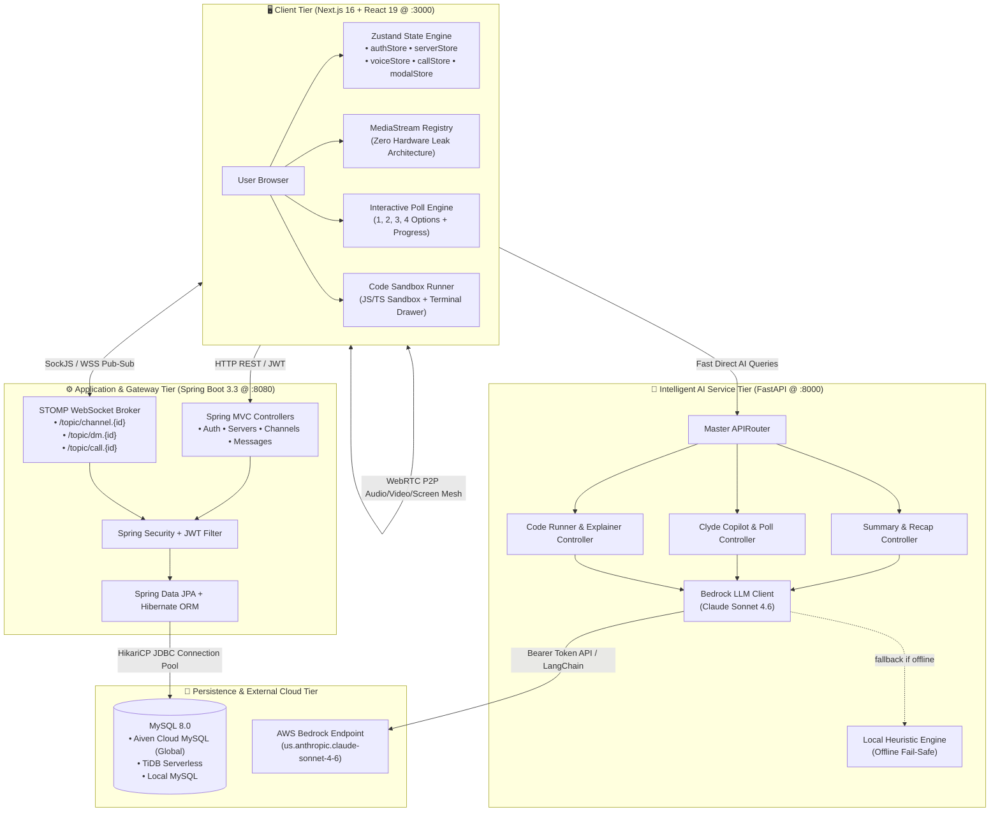
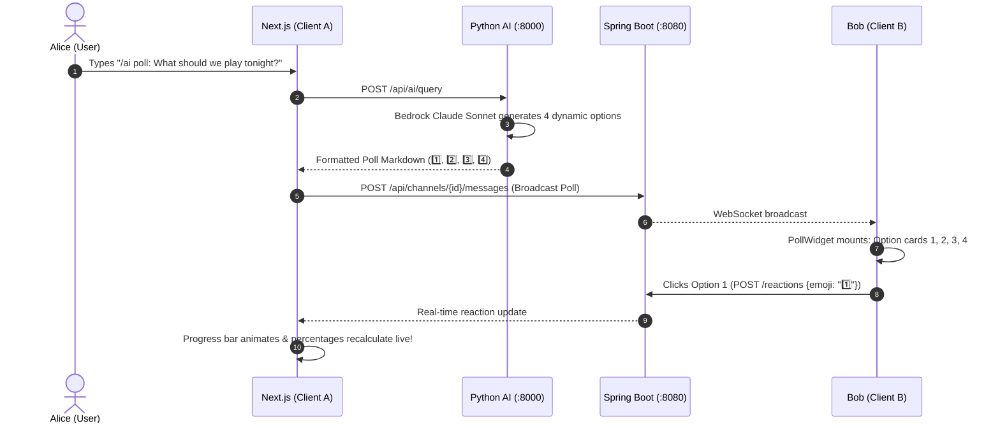
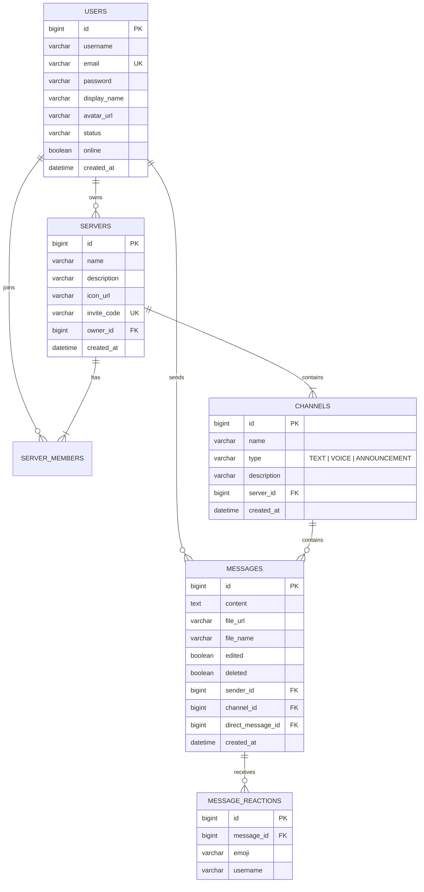

# 🚀 Discord Clone & Intelligent AI Workspace (Discord_AI)

[](https://nextjs.org/)
[](https://react.dev/)
[](https://spring.io/projects/spring-boot)
[](https://fastapi.tiangolo.com/)
[](https://aws.amazon.com/bedrock/)
[](https://www.mysql.com/)
[](https://stomp.github.io/)
[](https://webrtc.org/)

An enterprise-grade, full-stack **Discord Clone** featuring real-time WebRTC audio/video group calling, STOMP WebSockets messaging, 100% custom inline CSS Discord dark-mode aesthetics, interactive **Community Polls**, an in-chat **Code Sandbox Runner**, and a modular **MVC Python AI Service Layer** powered by **AWS Bedrock Claude Sonnet**.

---

## ⚡ 1-Liner Quickstart

> **Yes! In just one line, add your API key and launch everything:**

```bash
# Set your AI key and launch all 3 tiers with 1 command:
echo "AWS_BEARER_TOKEN_BEDROCK=your-key-here" > ai_service/.env && chmod +x start.sh && ./start.sh
```

`start.sh` automatically coordinates and launches:
1. 🟢 **Spring Boot Backend** (`:8080`) — connects to MySQL and boots REST + WebSocket endpoints.
2. 🟢 **Python AI Service (MVC)** (`:8000`) — boots FastAPI with AWS Bedrock Claude Sonnet.
3. 🟢 **Next.js Frontend** (`:3000`) — launches React 19 app and opens in your browser.
4. 🛑 **Graceful Shutdown** — pressing `Ctrl+C` cleanly terminates all 3 background processes.

---

## 🌟 Highlights & Superb Power Features

### 1. 📊 Interactive Discord Community Polls (Separate 1, 2, 3, 4 Options)
- **Separate Option Cards**: When typing `/ai poll: [topic]`, Clyde AI dynamically generates 4 distinct, topic-tailored options via Claude Sonnet Bedrock.
- **Click-to-Vote**: Users can click option **1**, **2**, **3**, or **4** to cast or change their vote.
- **Live Progress Bars & Percentages**: Each option features an animated progress bar that fills proportionally to its vote share, with green highlights for the winning choice.
- **Real-Time Sync**: Poll votes sync across server members using real-time message reactions.

### 2. 🖥️ Screen Sharing Theater & Spotlight Mode in Voice Stage
- **16:9 Cinema Spotlight**: Clicking **"Share Screen"** automatically expands the stream into a dedicated high-resolution theater view.
- **Broadcast Badges**: `🔴 LIVE` animated indicator, `1080p 60FPS` badge, and `🖥️ Screen Share • {User}` presenter tag.
- **Participant Filmstrip**: A right-hand sidebar keeps member avatars, speaking glow rings, and mute indicators visible alongside the active screen.
- **Zero Microphone Leaks**: Global media stream registry guarantees all audio, video, and screen tracks are terminated on disconnect, route change, or logout.

### 3. 💻 Inline Code Sandbox & Runner in Chat (with Clyde AI Explainer)
- **Automatic Code Block Detection**: Formats markdown code blocks with language pills (`JS`, `PYTHON`, `TS`, `SQL`, `BASH`), line count, and a 1-click **Copy** button.
- **"▶️ Run Code" Action**:
  - **JavaScript / TypeScript**: Executes inside an isolated, safe browser sandbox with custom console interceptors and execution timing in milliseconds.
  - **Python**: Safely runs in an isolated Python sub-process with strict timeout and security filtering via `/api/ai/run-code`.
- **Collapsible Terminal**: Dark `#0c0d0e` terminal drawer beneath code blocks displays real-time stdout outputs and error traces.
- **"🤖 Explain" Button**: 1-click code breakdown from Claude Sonnet on Bedrock explaining logic, time complexity, and edge cases.

### 4. 📝 AI Voice Channel Session Recap & Meeting Notes Generator
- **Live Duration Timer**: Displays elapsed voice session time in the channel toolbar.
- **"📝 Session Recap" Button**: Directly calls `/api/ai/meeting-recap` to produce executive notes.
- **Voice Recap Modal**:
  - Executive Summary callout
  - Key Decisions list with checkmarks
  - Assigned Action Items with clickable `@username` tags
  - Topic pill tags (`#Architecture`, `#WebRTC`, `#Sprint-Goals`)
- **"📢 Post to #general" Button**: Instantly publishes the meeting notes as Clyde AI into the server's text channel.

---

## 🏛️ High-Level Design (HLD)

### 1. System Topology & Tier Architecture



### 2. Interactive Poll & Message Flow



---

## 🔍 Low-Level Design (LLD)

### 1. Database Entity-Relationship (ER) Schema



---

## 🌐 Global Cloud MySQL Setup (Connect with Friends Worldwide)

By default, the backend connects to your local MySQL on `localhost:3306`. If you want everyone across the world to access your Discord servers, messages, and calls simultaneously, connect to a **free live cloud database**:

### 🌟 Option 1: Aiven for MySQL (Recommended — 100% Free, No Credit Card)

Aiven provides a full **MySQL 8.0 cloud instance** on AWS/GCP that runs 24/7 without sleeping.

1. **Sign Up**: Go to **[aiven.io](https://aiven.io/)** and sign up (completely free, no credit card required).
2. **Create Service**:
   - Click **Create Service** → Select **MySQL**.
   - Choose the **Free Plan** (5 GB SSD, 1 GB RAM, 1 CPU).
   - Choose a cloud region closest to you (e.g. `aws-ap-south-1` Mumbai, `aws-us-east-1` N. Virginia, or `aws-eu-west-1` Frankfurt).
   - Click **Create Free Service**.
3. **Copy Credentials**:
   - In the Aiven dashboard overview, copy:
     - **Host** (e.g. `mysql-xxxx-project.aivencloud.com`)
     - **Port** (e.g. `12345`)
     - **User** (default: `avnadmin`)
     - **Password**
     - **Database Name** (default: `defaultdb`)
4. **Plug into Your App**:
   Set in `backend/src/main/resources/application.properties` (or as environment variables `DB_URL`, `DB_USERNAME`, `DB_PASSWORD`):
   ```properties
   spring.datasource.url=jdbc:mysql://<your-host>.aivencloud.com:<port>/defaultdb?sslmode=require
   spring.datasource.username=avnadmin
   spring.datasource.password=<your-password>
   spring.datasource.driver-class-name=com.mysql.cj.jdbc.Driver
   ```

*Hibernate automatically initializes and maintains all database schemas upon startup!*

---

### 🌟 Option 2: TiDB Serverless (25 GB Free Forever)

1. Go to **[tidbcloud.com](https://tidb.cloud/)** and sign in with GitHub.
2. Click **Create Cluster** → Choose **Serverless** (25 GB free forever).
3. In `application.properties`:
   ```properties
   spring.datasource.url=jdbc:mysql://gateway01.<region>.prod.aws.tidbcloud.com:4000/<dbname>?sslmode=VERIFY_IDENTITY
   spring.datasource.username=<username>
   spring.datasource.password=<password>
   spring.datasource.driver-class-name=com.mysql.cj.jdbc.Driver
   ```

---

## 🤖 Python AI Service Architecture (MVC)

```
ai_service/
├── main.py                          # FastAPI application factory & CORS configuration
├── requirements.txt                 # Dependencies (fastapi, uvicorn, pydantic, langchain-aws, boto3)
├── .env                             # Bedrock credentials (AWS_REGION, AWS_BEARER_TOKEN_BEDROCK, BEDROCK_MODEL_ID)
├── tests/
│   └── test_ai_service.py           # Unit test suite (10/10 tests passing)
└── app/
    ├── core/                        # Core configuration & logging
    │   ├── config.py                # App settings & Bedrock get_llm() factory
    │   └── logger.py                # Unified logging system
    ├── models/                      # [M] Pydantic DTOs & Domain Schemas
    │   ├── message.py               # MessageItem, ChannelContext
    │   ├── summary.py               # SummarizeRequest, SummarizeResponse
    │   ├── reply.py                 # SmartRepliesRequest, SmartRepliesResponse
    │   ├── draft.py                 # DraftRequest, DraftResponse, DraftStyle
    │   ├── assistant.py             # QueryRequest, QueryResponse
    │   ├── insights.py              # ChannelInsightsRequest, SentimentMetric
    │   └── meeting.py               # MeetingRecapRequest, CodeRunRequest
    ├── views/                       # [V] Presentation & Discord Markdown Formatters
    │   ├── discord_formatters.py    # Embed formatters, 4-option poll cards, announcements
    │   └── response_views.py        # Standardized API response presenters
    ├── services/                    # [S] AI & NLP Business Logic
    │   ├── summarizer_service.py    # Channel summarization & voice meeting recap with Bedrock
    │   ├── reply_service.py         # Intent-based smart quick replies
    │   ├── draft_service.py         # Tone rewrite engine (Discord, professional, emojis, etc.)
    │   ├── clyde_service.py         # Clyde AI conversational copilot & dynamic 4-option polls
    │   ├── code_runner_service.py   # Safe Python execution sandbox & Claude code explainer
    │   └── sentiment_service.py     # Sentiment analysis & channel activity analytics
    └── controllers/                 # [C] FastAPI APIRouters
        ├── api_router.py            # Master router aggregator
        ├── health_controller.py     # GET /health
        ├── summary_controller.py    # POST /api/ai/summarize, /api/ai/insights, /api/ai/meeting-recap
        ├── reply_controller.py      # POST /api/ai/smart-replies
        ├── draft_controller.py      # POST /api/ai/draft
        └── assistant_controller.py  # POST /api/ai/query, /api/ai/run-code, /api/ai/explain-code
```

### Complete AI Endpoints Reference

| Method | Route | Controller | Model / Engine | Description |
| :--- | :--- | :--- | :--- | :--- |
| `GET` | `/health` | `HealthController` | System | Reports service health, version, and Bedrock connectivity. |
| `POST` | `/api/ai/summarize` | `SummaryController` | Claude Sonnet 4.6 | Produces an executive channel digest with highlights, action items, and smart replies. |
| `POST` | `/api/ai/meeting-recap` | `SummaryController` | Claude Sonnet 4.6 | Produces structured voice meeting notes with assigned action items. |
| `POST` | `/api/ai/smart-replies` | `ReplyController` | Claude Sonnet 4.6 | Produces 3-4 context-aware 1-click reply chips based on latest messages. |
| `POST` | `/api/ai/draft` | `DraftController` | Claude Sonnet 4.6 | Rewrites text in `discord`, `professional`, `concise`, `emojis`, or `bullet_points`. |
| `POST` | `/api/ai/query` | `AssistantController` | Claude Sonnet 4.6 | Powers in-chat `/ai` bot for questions, 4-option polls, and announcements. |
| `POST` | `/api/ai/run-code` | `AssistantController` | Subprocess Sandbox | Safely executes Python code with timeout and security guards. |
| `POST` | `/api/ai/explain-code` | `AssistantController` | Claude Sonnet 4.6 | Analyzes and explains code snippets with step-by-step logic breakdown. |
| `POST` | `/api/ai/insights` | `SummaryController` | NLP Engine | Evaluates channel sentiment, energy score, and active speaker themes. |

---

## 🧪 Testing & Verification

```bash
# 1. Run Python AI Unit Test Suite (10/10 tests)
python3 -m unittest ai_service/tests/test_ai_service.py

# 2. Validate Next.js TypeScript Compilation
cd frontend && npx tsc --noEmit

# 3. Health Checks
curl -s http://localhost:8000/health
curl -s http://localhost:8080/api/auth/login
curl -s -I http://localhost:3000
```

---

## 🔒 Zero Microphone Hardware Leaks Guarantee

- **The Problem**: In single-page applications, uncleaned `MediaStream` tracks or speaking detectors keep holding the hardware recording session, leaving Chrome's red recording dot on forever.
- **Our Solution**: [`frontend/lib/mediaManager.ts`](frontend/lib/mediaManager.ts) implements an authoritative registry. Whenever `disconnectVoice()`, `endCall()`, `useAuthStore.logout()`, or `window.beforeunload` triggers, `stopAllMediaStreams()` iterates through every active track and forces:
  ```ts
  track.stop();
  track.enabled = false;
  ```
  Immediately shutting down browser indicators and protecting user privacy.

---

## 📄 License

This project is licensed under the MIT License.
